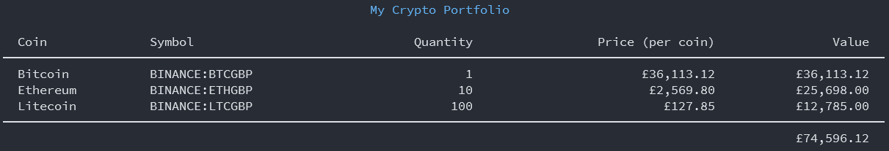

# Crypto Portfolio

A simple console application to keep a track of your crypto portfolio in real time.



## Getting Started

- Install the [.NET SDK](https://dotnet.microsoft.com/download)
- Create an account at [https://finnhub.io/](https://finnhub.io)
- Configure your Finnhub API Key either in the appsettings.json file:

  ```json
  "finnhub": {
      "apiUri": "https://finnhub.io/api/v1",
      "webSocketUri": "wss://ws.finnhub.io",
      "apiKey": "<your-finnhub-api-key-here>"
  }
  ```

  or using [dotnet user secrets](https://docs.microsoft.com/en-us/aspnet/core/security/app-secrets?view=aspnetcore-5.0&tabs=windows#secret-manager):

  ```bash
  dotnet user-secrets set finnhub:apiKey <your-finnhub-api-key-here>
  ```

- Configure your portfolio of holdings in the appsettings.json file

  ```json
  "portfolio": [
      {
          "coin": "Bitcoin",
          "symbol": "BINANCE:BTCGBP",
          "quantity": 1
      },
      {
          "coin": "Ethereum",
          "symbol": "BINANCE:ETHGBP",
          "quantity": 10
      },
      {
          "coin": "Litecoin",
          "symbol": "BINANCE:LTCGBP",
          "quantity": 100
      }
  ]
  ```

  A full list of exchanges and symbols can be found using the Finnhub API

  - GET https://finnhub.io/api/v1/crypto/exchange?token=\<your-finnhub-api-key-here>
  - GET https://finnhub.io/api/v1/crypto/symbol?exchange=binance&token=\<your-finnhub-api-key-here>

- Run

  ```bash
  dotnet run
  ```
